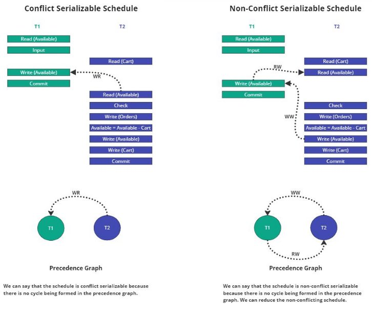

# DBMS Project Report: FlipMart

## User Guide

**Functionalities:**

The program starts asking the user to login either as an administrator or a customer in the Retail Store System. If the user is an Admin, they are authenticated using a username and password. Both the customer and the admin will be able to access the records of the branch they are registered in. The interface provides various functionalities to the two types of users as listed below.

**Admin** can perform the following functions:

1. View the available products at their branch.
1. Add a product to their branch. It may or may not be available at other branches.
1. Alter the quantity of a product available at the branch warehouse. This may be used when a new stock is brought in or the products are sold from some other outlet as well.
1. Change the password they have to use for authentication.
1. Reward coupons to the customers either randomly or on the basis of the maximum number of orders.
1. Add a new customer to the branch.
1. View the sales performance and statistics of the branch.

**Customer** can perform the following functions:

1. View the available products at their branch.
1. View the contents of their current cart.
1. Add a product to their cart with the quantity they want to specify.
1. Alter the quantity of or remove the products present in their cart currently.
1. Place their final order. The contents of the entire cart will be ordered on the behalf of the user, but they have been given multiple opportunities to change the contents before that. A warning is displayed before the order is placed as well. The coupon available to them which offers the maximum discount will automatically be applied on the order and a receipt will be generated.
1. View all the coupons available to them.

## Relations:

The tables or relations that have been used in the database are described below. The attributes of all the tables have been listed and the primary keys in them have been underlined as per convention.

**Admin :** Details of admins of various branches (Branch and Admin have a one-one relationship) User\_id, Username, Pass\_word, Pincode

**Available :** Available products at a particular branch Pincode, Product\_id, Quantity

**Branch :** Names of branches of a pincode which will be used as a foreign key in other tables Area, Pincode

**Cart :** Contents of carts of all the customers User\_ID, Product\_ID, Quantity

**Coupon :** (Order\_id and order\_date are set to null until the coupon is availed)

Coupon\_ID, Min\_Order\_Amt, Valid\_Until\_Date, Discount\_Offered, Date\_Of\_Issue, Order\_id, Order\_date, user\_id

**Customer :** Customers’ details

User\_ID, Name, Contact\_no, Total\_no\_of\_orders, pincode

**Orders :** Description of the orders placed

Order\_id, Order\_date, Total\_price, Delivery\_date, Pincode, user\_id

**Product :** Description of the products available at all the branches Product\_id, Product\_name, Price

**Products\_In\_Order :** Description of the products in the orders in queue Order\_id, User\_id, Product\_id, quantity

## Transactions

T1: Admin A changes the quantity of available products at a branch.

T2: Customer C checks whether products in their cart are available at the nearest branch and then proceed with the order by making an entry in the order table, emptying their cart and deleting the corresponding items from the available list.

**T1**

**Read(Available):** Read quantity from available **Input:** Take input from user

**Write(Available):** Write new quantity into available

**T2**

**Read(Cart):** Read quantity from cart **Read(Available):** Reads quantity in available **Check:** Compare quantity in both tables **Write(Orders):** Create new order entry in orders **Available :**= Available - Cart

**Write(Available):** Updates available table **Write(Cart):** Empties cart

